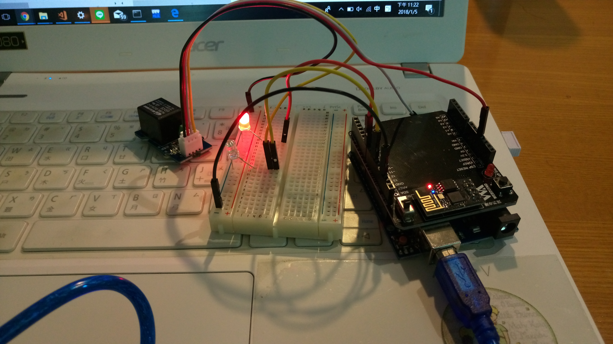
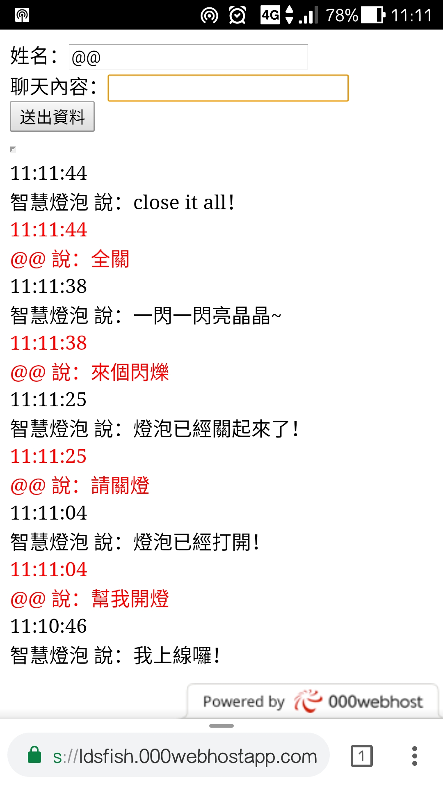

# NQUIOT106
物聯網通識專題-Smart Home Bot
106學年第一學期第九組

Bot運作方式：  
開啟架好的網頁：https://ldsfish.000webhostapp.com/bot.html  
讓電路通電之後即可連線(可不依賴webduino的介面)  
亦可從手機端開啟  

```
聊天室的對應情況如下：
開燈>>>亮blue LED、導通繼電器並回應燈泡已經開啟
關燈>>>亮red LED、關閉繼電器並回應已經關閉
閃爍>>>LED交替閃爍、並回應一閃一閃亮晶晶
全關>>>關閉所有LED燈、並回應close it all
```


展示影片：https://github.com/LdsFish/NQUIOT106/blob/master/image/botcallled.mp4


參考webduino的智慧插座概念  
https://ithelp.ithome.com.tw/articles/10188257  
修改調整成聊天室關鍵字可切換不同顏色的LED燈顯示來結合繼電器的開關
